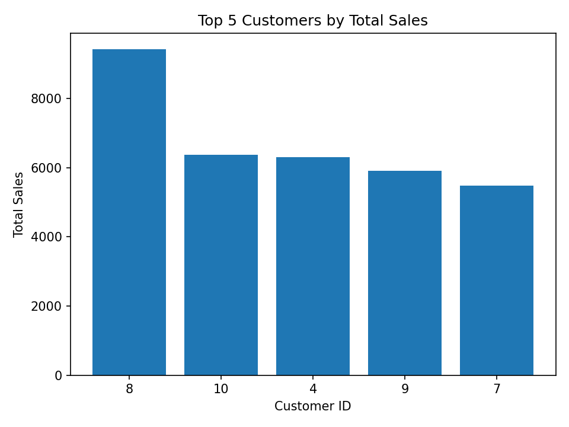
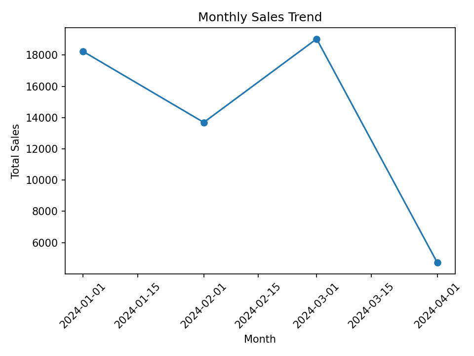

# 📊 Mode-Style Sales Analysis

[](https://www.python.org/)
[](https://www.postgresql.org/)
[](https://jupyter.org/)
[](https://pandas.pydata.org/)
[](https://matplotlib.org/)

> A simple project that replicates the [Mode Analytics](https://mode.com) workflow (SQL → Python → Dashboard) using **PostgreSQL + Jupyter Notebook**.

This project mimics the [Mode Analytics](https://mode.com) workflow:
- **SQL Query**: Run in PostgreSQL (Top 5 customers by sales).
- **Python Analysis**: Pandas to calculate monthly trends.
- **Visualization**: Matplotlib charts for insights.
- **Dashboard**: Export notebook to HTML (simulating Mode report).

---

## 📂 Project Structure

Mode/
├── Data/
│ └── sales_data.csv
├── notebooks/
│ └── Modeminiproject.ipynb
├── Outputs/
│ ├── monthly_sales_trend.png
│ └── top_customers.png
├── requirements.txt
├── .gitignore
└── README.md


---

## ⚙️ Tech Stack
- PostgreSQL 17
- Python 3.x
- Pandas, Matplotlib, SQLAlchemy, Psycopg2, Jupyter

---

## 🚀 How to Run
1. Clone the repository
   ```bash
   git clone https://github.com/YOUR-USERNAME/mode-style-sales-analysis.git
   cd mode-style-sales-analysis


pip install -r requirements.txt

jupyter notebook


📈 Sample Outputs

## 🖼️ Project Demo Screenshots

### Top 5 Customers by Total Sales


### Monthly Sales Trend


### (Optional) Revenue by Product


